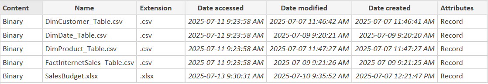
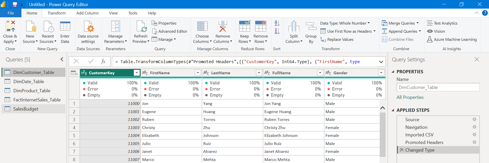

# **Sales Analysis Of AdventureWorksDW2019 Data Analyst Project:**


## **(1) Project Roadmap:**
1. **Define Problem Statement:** Clearly outline objectives, and business requests.
2. **Data Extraction:** Use SQL to extract target data from (AdventureWorksDW2019) Data Warehouse and clean it for analysis.
3. **Dashboard Creation:** Develop a dynamic Power BI dashboard to visualize key metrics.


##  **(2) Business Request:**

**2.1. Sales Analysis:**

- **Product Sales**: Determine the quantity of each product sold.
- **Client Segmentation**: Identify which clients purchased these products.
- **Temporal Analysis**: Analyze how sales have evolved over time.

**2.2. Budget Comparison:**
- Compare the actual sales numbers against the budgeted figures.

- The budget covers the period from **2021** to **2025** and has been included in a spreadsheet for performance comparison.

##  **(3) Introduction:**
The Sales Analysis of **(AdventureWorksDW2019)** project aims to dissect and interpret sales data to **facilitate strategic business decisions**. By employing **SQL** for data extraction and **Power BI** for visualization, the project seeks to **transform raw data into meaningful insights**. The focus is on understanding **sales trends, customer behavior, and budget performance to optimize sales strategies and enhance customer engagement**.

This analysis will address key business inquiries, including identifying **top-selling products, analyzing customer purchasing patterns, and comparing actual sales against budgeted figures from 2021 to 2025**. The insights gained will enable stakeholders to make informed decisions, ultimately driving revenue growth and operational efficiency.

##  **(4) Data Extraction and Preparation (SQL Data Querying):**
### **4.1. Data Extraction for (Dim_Product_Table):**
```sql
-- Cleansed DimProduct Table:
SELECT 
	p.ProductKey,
	p.ProductAlternateKey AS ProductItemCode,
	p.EnglishProductName AS ProductName,
	c.EnglishProductCategoryName AS Category,
	sub.EnglishProductSubcategoryName AS SubCategory,
	p.Color AS Color,
	p.Size AS Size,
	p.ProductLine AS ProductLine,
	p.ModelName AS ModelName,
	p.EnglishDescription AS Description,
	ISNULL(p.Status, 'Outdated') AS Status
FROM
	DimProduct AS p LEFT JOIN DimProductSubcategory AS sub
	ON p.ProductSubcategoryKey = sub.ProductSubcategoryKey
	LEFT JOIN DimProductCategory AS c
	ON sub.ProductCategoryKey = c.ProductCategoryKey
ORDER BY 
	p.ProductKey ASC;
```
### **4.2. Data Extraction for (DimCustomer_Table):**
```sql
-- Cleansed DimCustomer Table:
SELECT
	c.CustomerKey,
	c.FirstName,
	c.LastName,
	CONCAT(TRIM(c.FirstName), ' ', TRIM(c.LastName)) AS FullName,
	CASE
		WHEN UPPER(TRIM(c.Gender)) = 'F' THEN 'Female'
		WHEN UPPER(TRIM(c.Gender)) = 'M' THEN 'Male'
	END AS Gender,
	c.DateFirstPurchase,
	g.City AS City,
	g.EnglishCountryRegionName AS Country
FROM 
	DimCustomer AS c LEFT JOIN DimGeography AS g
	ON c.GeographyKey = g.GeographyKey
ORDER BY
	c.CustomerKey ASC;
```
### **4.3. Data Extraction for (DimDate_Table):**
```sql
-- Cleansed DimDate Table:
SELECT
	DateKey,
	FullDateAlternateKey AS Date,
	EnglishDayNameOfWeek AS Day,
	WeekNumberOfYear AS WeekNumber,
	EnglishMonthName AS Month,
	SUBSTRING(EnglishMonthName, 1, 3) AS MonthShort,
	MonthNumberOfYear MonthNumber,
	CalendarQuarter AS Quarter,
	CalendarYear AS Year
FROM
	DimDate
WHERE
	CalendarYear >= '2021' AND CalendarYear <= '2024';
```
### **4.3. Data Extraction for (FactInternetSales_Table):**
```sql
-- Cleansed FactInternetSales Table:
SELECT 
	ProductKey,
	OrderDateKey,
	DueDateKey,
	ShipDateKey,
	CustomerKey,
	SalesOrderNumber,
	OrderQuantity,
	UnitPrice,
	SalesAmount
FROM
	FactInternetSales
WHERE
	LEFT(OrderDateKey, 4) >= '2021' AND LEFT(OrderDateKey, 4) <= '2024';
```

##  **(5) Exporting Query Results to CSV:**
In this section, we focus on exporting the refined and cleansed data obtained from SQL queries into CSV format. This process facilitates further analysis and integration with other data analysis tools, ensuring that the data is readily accessible for visualization and reporting purposes.

By converting the SQL query results into CSV files, we enable seamless data manipulation and sharing across different platforms, thereby enhancing the flexibility and scalability of our data analysis.



##  **(6) Data Integration into Power BI (Importing Datasets into Power BI):**
In the **Data Integration into Power BI** section, we import **CSV files** and **Excel budget document** into **Power BI**, consolidating diverse data sources for unified analysis and visualization. 

**Power Query** enhances this process with its robust data transformation and cleansing capabilities, ensuring data accuracy and optimization. This integration is crucial for creating dynamic reports and dashboards, facilitating informed decision-making.




https://github.com/user-attachments/assets/f2ed213d-9e53-4622-ba5d-45889119aa0d
